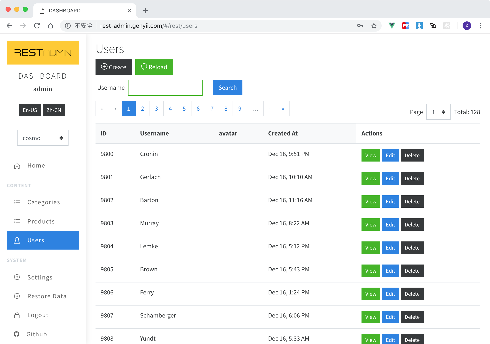
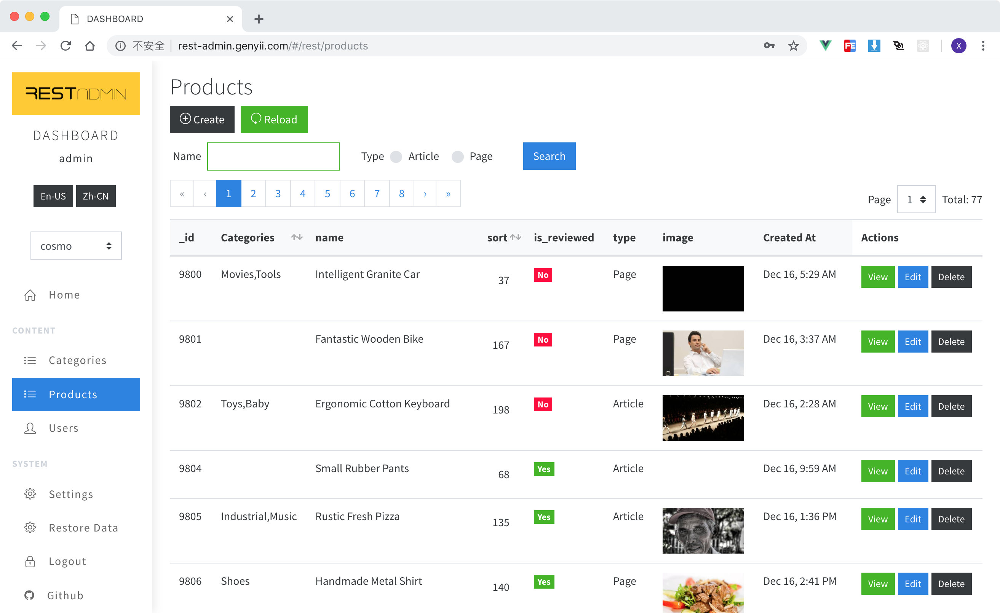
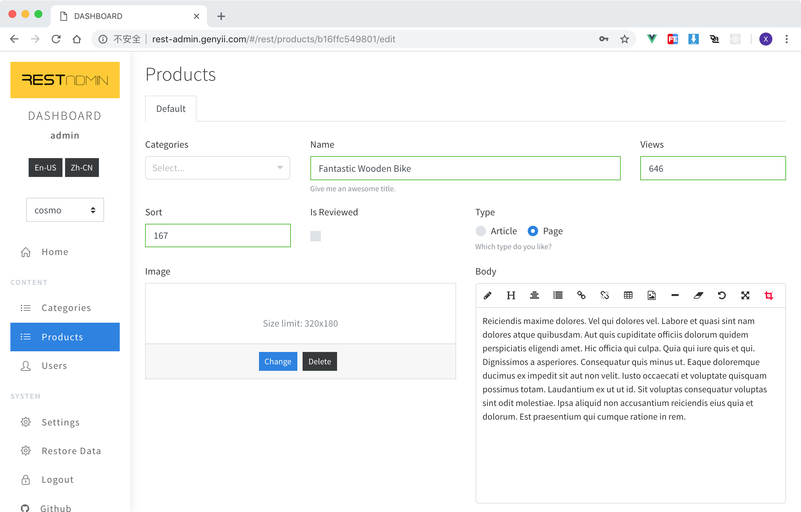

# REST-ADMIN

### 如果觉得有用，请在爱发电上赞助我： https://afdian.net/@johnny ，让我可以分出更多精力来完善它。

> 一个基于 Vue.js 和 Boostrap 4的后台UI.

REST-ADMIN试图让你在构建后台管理界面的时候更轻松点，所有你需要做的仅仅是提供一个后台服务的RESTFul API而已。

## 在线DEMO
#### http://rest-admin.genyii.com/ 
> 用户名:密码 `admin:admin`

## 截图
| - | - |
|--|--|
| 登录| 用户列表|
| 博客列表| 博客编辑表单|
| 全栈之巅微信群 <br> 加微信拉群: johnny77577| 免费视频教程-《全栈之巅》微信小程序|

## 功能
- 基于最新的Bootstrap和VueJs，这意味着你可以方便地切换各种基于bootstrap框架的CSS皮肤
- 纯前端的VueJs项目，可以无缝对接任何类型的后端RESTful API
- 强大的 **Data Table**，自带排序、分页、搜索、显示图片等等功能
- 强大的 **Data Form Builder**，可以显示/编辑各种类型的值：文本、图片、布尔值等等
- 支持基于资源的各项CRUD操作
- 基于英语的i18n支持
- **高度可配置的**站点信息。如：网站名称、LOGO、**后台菜单**以及底部信息。
- 可用于实际项目。已经应用于公司的两个项目中

## 快速开始
```bash
git clone git@github.com:wxs77577/rest-admin.git
cd rest-admin
code . # 用VSCODE打开项目
npm i # 或者 cnpm i

# 和本地测试API一起启动
npm run test-api # 启动测试API
npm run serve # 启动REST-ADMIN客户端
```

> 测试API的后台登录用户名及密码为 `admin` 和 `admin`

### 发布
```bash
API_URI=http://localhost:5555/admin/api/ npm run build
```
然后只需要把`/dist/admin/`文件夹复制到对应的地方就好了

> 测试API基于`express`


## 字段定义
> 用于表格和表单中
> 默认主键字段为`_id`，你可以在`/src/config.json`中随意更改它。

范例:
```json
{
  "_id": { "label": "ID" },
  "title": { "label": "标题" },
  "type": { "label": "类型", "type": "select", "options": [
    { "text": "Vue", "value": "vue" },
    { "text": "React", "value": "react" },
    { "text": "Angular", "value": "angular" },
  ]},
  "body": { "type": "html", "group": "详情" },
  "steps": { "type": "array", "group": "阶段", "fields": {
    "name": { "label": "名称" },
    "date": { "label": "日期" } 
  }},
  
  "_actions": { // 定义表格视图中的一些额外选项
    "buttons": { // 要隐藏“操作”栏中的某个按钮请把它设置为false
      "delete": false,
      "edit": false
    },
    "toolbar": { // 定义表格视图顶部的按钮
      "extra": [ // 添加额外按钮
        //所有`<b-button>`支持的属性
        { "to": "/form?uri=vouchers/generate", "label": "Generate Vouchers" }
      ]
    }
  }
}
```
### 字段属性
- `label` 显示的名称
- `cols` 占用栅格列宽度, 总数为12。（参考Bootstrap）
- `input_cols` 输入控件的宽度
- `group` 在创建、更新表单中的TAB分组名称
- `type` 字段类型。不同字段类型拥有不同的附加属性
  - `select` 来自 [b-select](https://bootstrap-vue.js.org/docs/components/form-select)  `bootstrap-vue` 的原生HTML `<select>` 标签
    - `options` e.g. `[{ "text": "显示名", "value": "1" }]`
  - `select2` [vue-select](https://github.com/sagalbot/vue-select), 类似jQuery的 `select2`
    - `options` e.g. `[{ "text": "显示名", "value": "1" }]`
  - `tree` [vue-treeselect](https://vue-treeselect.js.org/)
    - `options` **使用 `text` 和 `value` 代替 `label` 和 `id`** 如： `[{ "text": "Label", "value": "1", "children": [ { "text": "Item1", "value": "2" } ] }]`  
  - `date` [vue2-datepicker](https://github.com/mengxiong10/vue2-datepicker) 支持 **日期范围**
  - `switch` 类似iOS的开关控件
  - `html` 来自[vue-html5-editor](https://github.com/PeakTai/vue-html5-editor)的可视化HTML编辑器
  - `array` 数组值
    - `fields` 子字段定义
    - `is_table` 是否要显示为表格
  - `radiolist`
    - `options` 如： `[{ "text": "Label", "value": "1" }]`
  - `checkboxlist`
    - `options` 如： `[{ "text": "Label", "value": "1" }]`
  - `checkbox`
  - `file` 文件上传控件
    - `limit` 定义 **size** 字节数, e.g. `{ size: 1000000 }`
  - `image` 带有预览的图片上传控件
    - `limit` 定义 **width** **height** 和 **size** 字节数, 如： `{ "width": 320, "height": 180, size: 1000000 }`
  - `audio` 类似 `image`
    - `limit` 定义 **size** 字节数, e.g. `{ size: 1000000 }`
  - `video` 类似 `image`
    - `limit` 定义 **size** 字节数, e.g. `{ size: 1000000 }`
  - `textarea`
  - `number`
  - `text`
- `required`
- 以及https://bootstrap-vue.js.org/docs/components/form-input支持的任何其他属性，请注意：每种字段类型可能拥有不同的属性。

## 接口
> Tips: check `/api/index.js` :p

测试API: http://localhost:8088/admin/api

#### GET `/site` (url: http://localhost:8088/admin/api/site)
获取站点配置
- 返回值
  ```json
  {
    "name": "网站名称",
    "logo": "http://.../logo.png",
    "locale": "zh-CN", //or zh-CN
    "locale_switcher": false, //hide locale switcher
    "menu" : [
      {
        "name": "首页",
        "url": "/",
        "icon": "fa fa-home",
        // for home page
      },
      {
        "name": "内容管理",
        "title": true,
        // display as a delimiter
      },
      {
        "name": "文章",
        "url": "/rest/posts",
        "icon": "fa fa-list",
        // url format of resource list: /rest/:resourceName      
      },
      {
        "name": "设置",
        "url": "/form?uri=site/settings",
        "icon": "fa fa-cogs",
        // a custom form.
      },
      {
        "name": "注销",
        "url": "/login",
        "icon": "fa fa-lock",
        // for logout
      },
    ],
  }
  ```

#### POST `/login`
管理员登录
- POST 数据
  ```json
  {
    "username": "admin",
    "password": "admin"
  }
  ````
- 返回值
  ```json
  {
    "user": {
      "username": "admin",
      ...
    },
    "token": "1o2u3h4oi2u3h4jkashdflsda"
  }
  ```
  或者错误验证
  > 必须响应 `422` 的HTTP状态码
  ```json
  {
    "name":"HttpException",
    "message":[
      { "field":"password", "message":"密码不正确" }
    ]
  }
  ```

#### GET `/:resource`
获取某个资源列表
`:resource` 表示一个资源名称. 如： `/users`, `/posts`...

- 返回值 **IMPORTANT**
  ```json
  {
    "total": 80,
    "perPage": 10,
    "page": 1,
    "data": [
      {...},
      {...},
      {...},
    ]
  }
  ```

#### GET `/:resource/grid`
返回资源的表格视图配置
`:resource` 表示一个资源名称。 如： `/users/grid`, `/posts/grid`...

- 返回 **IMPORTANT**
  ```json
  {
    "searchModel": {},
    "searchFields": {
      渲染搜索字段
      ...参考 字段定义...
    },
    "fields": {
      渲染表格字段
      ...参考 字段定义...
    }
  }
  ```

#### GET `/:resource/form`
获取资源的编辑表单配置
`:resource` 表示资源名称。 如： `/users/form`, `/posts/form`...

- Returns **IMPORTANT**
  ```json
  {
    "model": {},
    "fields": {
      渲染表单字段
      ...参考 字段定义...
    }
  }
  ```

#### POST `/:resource`
创建资源
- POST 数据
  ```json
  {
    "_id": "12341234",
    "title": "The New Title",
    ...
  }
  ```
- 返回值
  ```json
  {
    "_id": "12341234",
    "title": "The New Title",
    ...
  }
  ```

#### PUT `/:resource/:id`
更新一个资源
- POST DATA (Request Payload)
  ```json
  {
    "_id": "12341234",
    "title": "The New Title",
    ...
  }
  ```
- 返回值
  ```json
  {
    "_id": "12341234",
    "title": "The New Title",
    ...
  }
  ```

#### DELETE `/:resource/:id`
删除一个资源
- 返回值
  ```json
  {
    "success": true
  }
  ```

#### DELETE `/:resource`
删除一个资源中的全部记录
- 返回值
  ```json
  {
    "success": true
  }
  ```

#### 自定义表单 ?
> 要显示一个自定义表单，你需要事先在`/site`接口中添加一个`menu`，或者在`/:resource/grid`的额外字段中加一个按钮。

自定义表单需要两个API：
1. 获取表单字段定义
  - GET `/site/settings`
  - 返回值
    ```
    {
      "title": "表单名称",
      "fields": {
        ...参考 字段定义...        
      }
    }
    ```
2. 处理表单提交
  - POST `/site/settings`
  - 返回值
    ```json
    {
      "success": true,
      "message": "干得漂亮！", //[可选] 会在提交之后显示在前端
      "redirect": "/" //[可选] 自动跳转到某个前端路由，默认是返回上一页
    }
    ```

## i18n
> 参考 [vu-i18n](https://github.com/kazupon/vue-i18n/)

REST-ADMIN 默认支持 `en-US` 和 `zh-CN`, 你可以修改`/src/i18n/*.json`中的翻译文件。

## 感谢
- 基于 Vue.js 和 Bootstrap v4 的 [bootstrap-vue](https://github.com/bootstrap-vue/bootstrap-vue)
- 来自 [Core UI](https://coreui.io/) 的漂亮的UI
- 来自 [vue-i18n](https://github.com/kazupon/vue-i18n/) 的 i18n 组件
